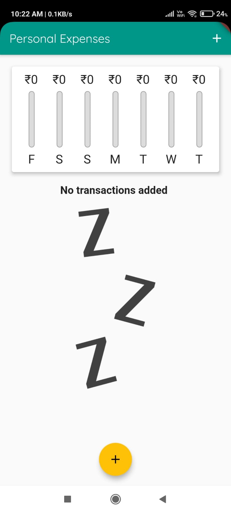
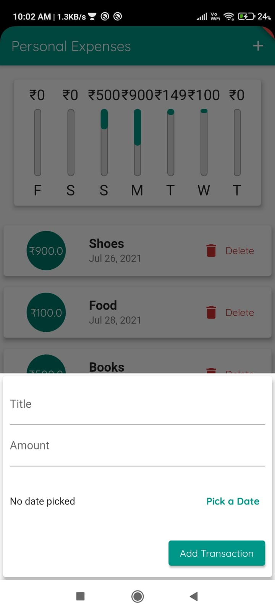
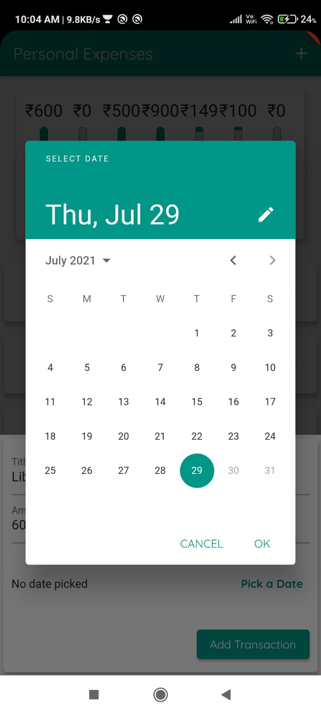
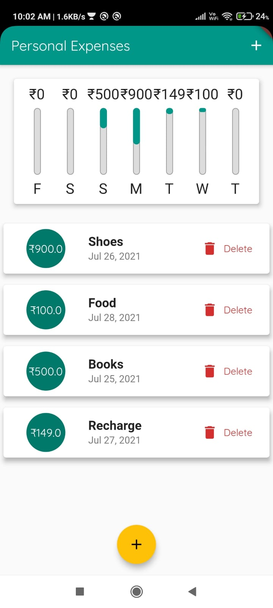
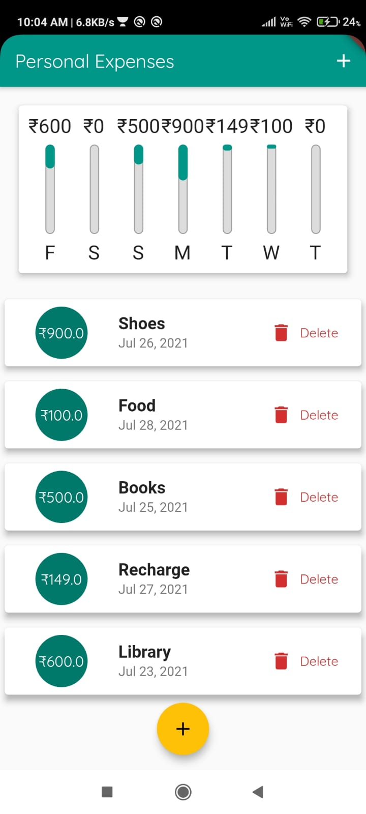

# Expenses Recorder - Flutter Application
>This app shows the Day-wise bar chart of last 7 days expenses and List of all the Expenses. 
>User can add their Daily Expenses with Title, Amount and Date of expense.
## Tech Stack:
	

## About the Application
### Home Screen
* The screenshot shown below is the default Home Screen of Expense App. 
* There are two buttons in the center below and in the Top right to add the new transaction.  
  
 
 ### After Pressing Button
 * The screenshot shown below is the screen after pressing the button.  
 * The user can add the Title, Amount and also Pick a date.  
   
   

 ### After Adding the Expense
 * Expense will be added in the list. 
 * Bar chart will also be updated.
    
   

## Want to contribute?
### To start contributing refer to the following steps:
**1.** Make sure you have got flutter (including the command line tool) and Android Studio installed.

**2.**  Fork [this](git@github.com:Gautamgarg991/Expense-App.git) repository.

**3.**  Clone your forked copy of the project.

     $ git clone https://github.com/<your_user_name>/.git

**4.** Make your changes

**5.** Add and commit your changes

     $ git add . && git commit -m "<your_message>"
     
**6.** Push Code to Github under your branch 

     $ git push origin <branch_name> 

